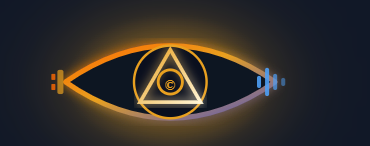

<div align="center">



# TRINETRA V5.0

### Multimodal Neural Search Registry · AI for Bharat

[](LICENSE)
[](https://python.org)
[](https://streamlit.io)
[](https://github.com/openai/CLIP)
[](https://github.com/LAION-AI/CLAP)
[](https://trinetra-ai-team-human.streamlit.app)

*Search images and audio in Hindi, Tamil, Telugu, Kannada, Malayalam, Bengali, Marathi, Gujarati, Punjabi & English — powered by Sarvam AI*

</div>.

---

# 🚀 Features

• Multimodal AI architecture
• Reverse image search using AWS Rekognition
• Web intelligence engine using DuckDuckGo scraping
• Lambda-based ingestion pipeline
• DynamoDB storage for scalable asset storage
• Compression-aware storage for large text assets
• Content hash deduplication
• Intelligent search pipeline via Lambda
• Streamlit interface for interactive exploration

---

# 🧠 System Architecture

Trinetra consists of multiple modular components:

### 1. Ingestion Layer

Handles incoming assets.

Supported modalities:

* Text
* Image
* Web content

Text assets are stored via an **AWS Lambda ingestion endpoint** and saved into **DynamoDB**.

---

### 2. Storage Layer

**AWS DynamoDB**

Each stored asset includes:

* `asset_id`
* `modality`
* `content`
* `encoding`
* `content_hash`
* `created_at`
* `ttl`

Large text payloads are automatically **compressed using zlib** before storage when beneficial.

---

### 3. Search Layer

Search queries are handled by:

**LambdaSearchClient**

Responsibilities:

* Query DynamoDB
* Decode compressed content
* Filter by modality
* Return structured results

---

### 4. Web Intelligence Layer

Uses **DuckDuckGo HTML search** and web scraping to collect information from public sources.

Components:

* WebSearchEngine
* Page text extraction
* Query expansion

---

### 5. Vision Intelligence Layer

Powered by **AWS Rekognition**

Capabilities:

* Label detection
* Text detection (OCR)
* Face detection
* Image-based web search queries

---

### 6. Interface Layer

Built using **Streamlit**

Provides:

* Search UI
* Image analysis tools
* Web results
* Multimodal results display

---

# ⚙ Installation

Clone the repository

```bash
git clone https://github.com/yajatkataria08-a11y/Trinetra_AI.git
cd Trinetra_AI
```

Install dependencies

```bash
pip install -r requirements.txt
```

Run the application

```bash
streamlit run app.py
```

---

# 🔑 Configuration

Create a `.streamlit/secrets.toml`

Example:

```toml
LAMBDA_SEARCH_URL = "your_lambda_function_url"
LAMBDA_INGEST_URL = "your_ingest_lambda_url"

AWS_ACCESS_KEY_ID = "your_access_key"
AWS_SECRET_ACCESS_KEY = "your_secret_key"
AWS_REGION = "us-east-1"
```

Environment variables can also be used instead.

---

# 📦 Requirements

Main dependencies:

* streamlit
* boto3
* requests
* beautifulsoup4
* pillow
* numpy

Install using:

```bash
pip install -r requirements.txt
```

---

# 🧪 Technologies Used

* Python
* AWS Lambda
* AWS DynamoDB
* AWS Rekognition
* Streamlit
* BeautifulSoup
* REST APIs
* Multimodal AI architecture

---

# 👨‍💻 Author

**Yajat Kataria**

Creator of the Trinetra AI system.

Designed and implemented:

* Core architecture
* AI pipeline integration
* Search engine
* Web intelligence engine
* Reverse image search
* Lambda integrations
* DynamoDB storage logic
* Streamlit interface

---

# 🤝 Contributor

**Aklesh Swain**

Contribution:

* AWS infrastructure pipeline setup
* AWS service configuration support

---

# ⚠ Intellectual Property Notice

Trinetra AI is an original project created by **Yajat Kataria**.

The architecture, design, and system implementation are proprietary.

This repository is published publicly **for demonstration and educational purposes only**.

---

# 📜 License

**Trinetra AI © 2026 Yajat Kataria**

All Rights Reserved.

This codebase may not be copied, modified, distributed, or used in commercial systems without explicit permission from the author.

Unauthorized use of this software or its architecture is prohibited.

---

# 🌌 Vision

Trinetra represents a step toward **fully multimodal AI systems capable of perceiving and reasoning across different forms of data**.

Future versions aim to expand into:

* Audio intelligence
* Video understanding
* Autonomous AI agents
* Hardware-integrated AI systems

: Production Ready


